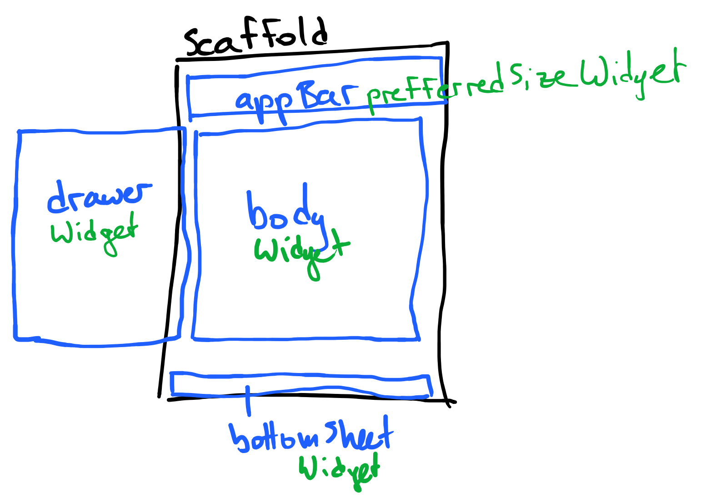
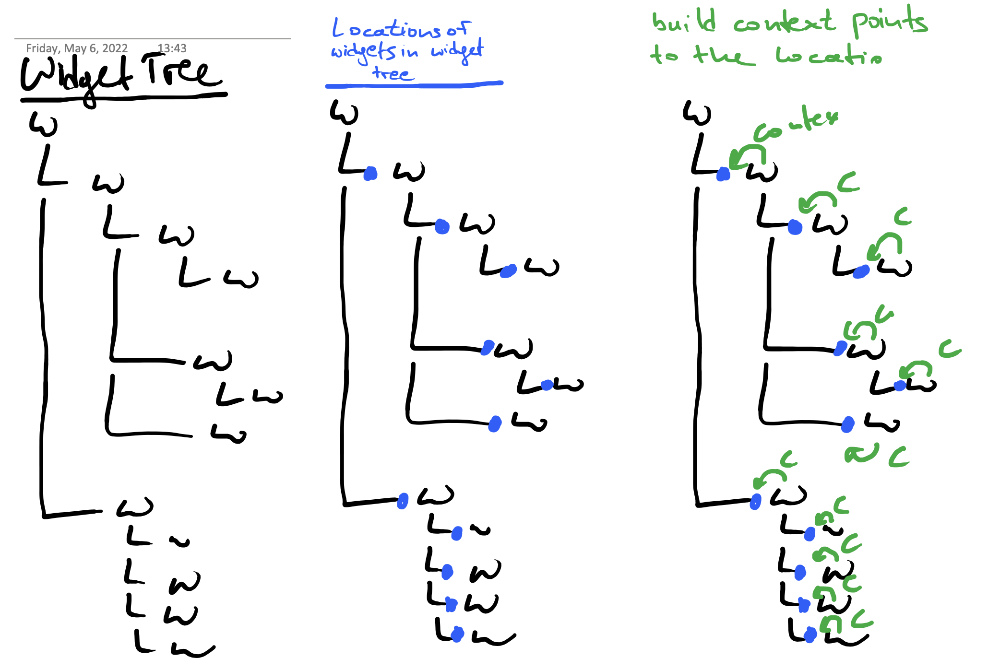

# What is this?

This is the way and resources I used to learn flutter.


# Don't use these sources

The following resources are regarded as *not good for learning*:

- flutter.dev/learn
  - Presenting non-working code


# Tutorial

## Very first steps
### Preparation

- No need to install everything first! Try out the online editor:
  - https://dartpad.dev/?id
  - → top left corner → *New Pad* → *Flutter Pad*

- Video tutorial source:
  This seems reasonable: https://www.youtube.com/watch?v=xWV71C2kp38&list=PLjxrf2q8roU3wk7CDw4RfV3mEwOJbjx1k&index=2


### Basic information

- In flutter *everything is a widget*
- Widgets are immutable (unchangable by default)
  - Therefore member vars of Widgets (`StatelessWidget`) are always `final`.
  - State changes are always done through `setState(() { [YOUR CODE ] });`
    - If you don't use `setState` for changes, the UI won't change.
  - Widgets are being built in their `build` method.<br>
    If the state changes, they are built newly, not changed.

- What's a `Scaffold`?
  - Check out a dictionary (something like *construct* or *structure*)
  - A `Scaffold` in flutter is a widget, that provides a basic layout for your screen/page:
    - E.g. Top bar, body, bottom bar, side menu.

### Hands-on start

Use [dartpad](https://dartpad.dev/?id), set it to Flutter (Top left corner -> New pad -> Flutter) and erase all code.

#### Very basic layout
(The following code will not yet compile.)

This shows the most simple structure of a program
```
import 'package:flutter/material.dart';

void main() {
  runApp();
}
```
↑
- Import flutter stuff.
- Set app entry point.
- `runApp()` takes a widget as argument, that it will put up as the very first widget shown on the screen. (*kind of like the windows manager in X?*)


(The code will still not compile)
```
import 'package:flutter/material.dart';

void main() {
  runApp(MyApp()); // <-- create widget instance
}

class MyApp extends StatelessWidget { // <-- define widget
  @override
  Widget build(BuildContext context) {

  }
}
```


#### First running code

This code runs, but does nothing except of saying "hey, I'm an app".

```
import 'package:flutter/material.dart';

void main() {
  runApp(MyApp());
}

class MyApp extends StatelessWidget {
  @override
  Widget build(BuildContext context) {
    return MaterialApp(
      title: "A Checklist App",
      theme: ThemeData(primarySwatch: Colors.blue),
    );
  }
}
```

**Info:**
- `MyApp` plays the `GtkApplication` role here. Meaning: it's a widget, but kind of like a very special one.
- `build(...)` method:
  - Similar to a `draw` method.
  - This tells flutter how to build (*draw*) the widget.
  - In this case our widget `MyApp` is defined as a `MaterialApp` with title *A Checklist App*
- `MaterialApp`:
  - Widget that provides much basic functionality of an app.
  - Derives from `WidgetsApp` (which can be an alternative).
  - Perhaps think of it as `GtkApplication`

#### Hello World

Show *Hello World* on screen:

```
import 'package:flutter/material.dart';

void main() {
  runApp(MyApp());
}

class MyApp extends StatelessWidget {
  @override
  Widget build(BuildContext context) {
    return MaterialApp(
      title: "A Checklist App",
      theme: ThemeData(primarySwatch: Colors.blue),
      home: const Text("Hello World"), // <-- This line is new
    );
  }
}
```

**Info**:
   In a `MaterialApp` the `home` member tells flutter what the topmost widget will be


#### Your own visible widget

Produce the same output as above, but add another layer of responsibility

```
import 'package:flutter/material.dart';

void main() {
  runApp(MyApp());
}

class MyApp extends StatelessWidget {
  @override
  Widget build(BuildContext context) {
    return MaterialApp(
      title: "A Checklist App",
      theme: ThemeData(primarySwatch: Colors.blue),
      home: MyTopScreen(), // <-- This line is new
    );
  }
}

// ↓ this is new

class MyTopScreen extends StatelessWidget
{
  @override
  Widget build(BuildContext context)
  {
    return const Text("Hello World");
  }
}

```


#### Create a nice looking screen

Change the `MyTopScreen` class as below

```
class MyTopScreen extends StatelessWidget
{
  @override
  Widget build(BuildContext context)
  {
    return Scaffold(  // ← ↓ This is new
      appBar:
        AppBar(title: const Text("Hello World")),
      body:
        const Text ("Screen body")
    );
  }
}
```

**Info**:
- `Scaffold`:
  - Widget that provides the very basic visual design and functionality of an *app page* has:<br>
    - Title bar (`appBar:`)
    - Body element (`body:`)
    - Footer (`bottomSheet:`)
    - Sidebar (`drawer:`)
    - 
  - All properties (like `appBar` or `body`) are found [here](https://api.flutter.dev/flutter/material/Scaffold-class.html#instance-properties)
- `AppBar`: Simply to the top titlebar within the `Scaffold`.


#### Create `TaskList`

Create a `TaskList` class (no checkboxes or input options, yet).

```
import 'package:flutter/material.dart';

void main() {
  runApp(MyApp());
}

class MyApp extends StatelessWidget {
  @override
  Widget build(BuildContext context) {
    return MaterialApp(
      title: "A Checklist App",
      theme: ThemeData(primarySwatch: Colors.blue),
      home: MyTopScreen(),
    );
  }
}

class MyTopScreen extends StatelessWidget
{
  @override
  Widget build(BuildContext context)
  {
    return Scaffold
    (
      appBar: AppBar
      (
        title: const Text("Hello World"),
      ),
      body: TaskList(), // <-- new
    );
  }
}

// ↓ new
class TaskList extends StatelessWidget
{
  @override
  Widget build (BuildContext context){
    return Column
    (
      children:[
        const Text ("Task 1"),
        const Text ("Task 2"),
        const Text ("Task 3"),
        const Text ("Task 4"),
      ]);
  }

}
```

**Info**:
- The `Tasklist` is defined as a colum containing 4 `Text` widgets (verticall)


#### Task list with (not checkable) checkboxes

```
import 'package:flutter/material.dart';


void main() {
  runApp(MyApp());
}


class MyApp extends StatelessWidget {
  @override
  Widget build(BuildContext context) {
    return MaterialApp(
      title: "A Checklist App",
      theme: ThemeData(primarySwatch: Colors.blue),
      home: MyTopScreen(),
    );
  }
}

class MyTopScreen extends StatelessWidget
{
  @override
  Widget build(BuildContext context)
  {
    return Scaffold(
        appBar: AppBar(
          title: const Text("Hello World"),
        ),
        body: TaskList()

    );
  }
}


class TaskList extends StatelessWidget
{
  @override
  Widget build (BuildContext context){
    return Column (
        children: [
// ↓↓↓↓　new code from here ↓↓↓↓↓
          TaskItem(label: "Task 1"),
          TaskItem(label: "Task 2"),
        ]);
  }
}


class TaskItem extends StatelessWidget {
  final String label;

    const TaskItem({Key? key_nullable, required this.label}) : super(key: key_nullable);

  @override
  Widget build(BuildContext context)
  {
    return Row
      (
        children:[
          const Checkbox(onChanged: null, value: false),
          Text(this.label),
        ]
    );
  }
}
```

**Info**:
- `TaskItem`
  - Is defined (see `build()`) as a `Row` containing a `Checkbox` and some `Text`
  - Constructor:
    - Looks difficult at first.
    - `Key?` means *Type `Key` or null*.
    - `required` means *cannot be null*.

#### Sidenotes

In Flutter, all widgets are immutable; Flutter does not allow any changes of objects.
Widgets are like a recipe for making a cake. They just describe how things should be
and flutter builds the UI exactly as they describe it.

#### Introducing a changing UI (/state)

We have to
- make `TaskItem` a `StatefulWidget` and
- introduce a *State* class, that can hold a state

```
import 'package:flutter/material.dart';

void main() {
  runApp(MyApp());
}

class MyApp extends StatelessWidget {
  @override
  Widget build(BuildContext context) {
    return MaterialApp(
      title: "A Checklist App",
      theme: ThemeData(primarySwatch: Colors.blue),
      home: MyTopScreen(),
    );
  }
}

class MyTopScreen extends StatelessWidget {
  @override
  Widget build(BuildContext context) {
    return Scaffold(
        appBar: AppBar(
          title: const Text("Hello World"),
        ),
        body: TaskList());
  }
}

class TaskList extends StatelessWidget {
  @override
  Widget build(BuildContext context) {
    return Column(children: [
      TaskItem(label: "Task 1"),
      TaskItem(label: "Task 2"),
    ]);
  }
}

// ↓↓↓ Changed code from here ↓↓↓

class TaskItem extends StatefulWidget {
  final String label;

  const TaskItem({Key? key_nullable, required this.label})
      : super(key: key_nullable);

  @override
  _TaskItemState createState() {
    return _TaskItemState();
  }
}


class _TaskItemState extends State<TaskItem> {
  bool? _value = false;

  void checkboxChanged(newValue)
  {
    setState(() => {
      _value = newValue
    });
  }

  @override
  Widget build(BuildContext context) {
    return Row(children: [
      Checkbox(
        onChanged: checkboxChanged,
        value: _value,
      ),
      Text(widget.label),
    ]);
  }
}
```

#### What? This ends here?

Yes, the original tutorial I personally used did not go on from here.

Unsatisfying, yes. But now we know some basics. From here we can go on


## Create a chat app

While following [this tutorial](https://codelabs.developers.google.com/codelabs/flutter/#3), see the notes below (if you think they could help you).

### Notes from the tutorial

- Icons:
  - [List of icons](https://api.flutter.dev/flutter/material/Icons-class.html)
  - [Example usage of icons](https://fonts.google.com/icons?selected=Material+Icons)
  - Icons inherit their style from an `IconTheme`:<br>
    
- BuildContext:
  - BuildContext has a handle to the location of a widget in the widget tree.
  - 
- What is a cross axis?
  - `MainAxis` is the axis for the Widget in which it is supposed to scroll.
  - `CrossAxis` is the one which is perpendicular (90 degrees) to MainAxis.
  - Reference: https://stackoverflow.com/a/52713953/6702598


## TODO: Next up ↓↓↓↓↓↓↓↓↓↓↓↓↓↓↓↓↓↓↓↓↓

**The following are personal notes: resources that have not yet proven to be valid**

- Anlesen und gucken, ob es einzuorgnen oder wegzuwerfen ist:
  - https://www.freecodecamp.org/news/learn-flutter-best-resources-18f88346ed0f/

- Making a TODO app with flutter:
  - https://medium.com/the-web-tub/making-a-todo-app-with-flutter-5c63dab88190

- Parsing complex JSON in Flutter
  - https://medium.com/flutter-community/parsing-complex-json-in-flutter-747c46655f51

- Andere codelab tutorials:
  https://github.com/flutter/codelabs

- Huge information collection about flutter:
  - https://github.com/flutter/codelabs

- Anlesen und gucken ob brauchbar oder Muell:
  - hackr.io/tutorials/learn-flutter?q=Flutter

- Books:
  - Learn flutter fast (10USD)
    - https://www.amazon.com/Learn-Google-Flutter-Fast-Example/dp/1092297375
  - beginning flutter (24 USD)
    - https://www.amazon.com/Beginning-Flutter-Hands-Guide-Development/dp/1119550823
