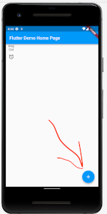

# What is this?

This is the way and resources I used to learn flutter.


### Don't use these sources

The following resources have proven to not be useful for me **as tutorials**:
- flutter.dev/learn
  - Presented code not working
  - However, it might be useful as reference (e.g. *widget of the week* videos)
- [medium.com: Parsing complex json in flutter](https://medium.com/flutter-community/parsing-complex-json-in-flutter-747c46655f51)
  - For beginners this does not contain enough information to follow.
  - Bad writing style for beginners


# Flutter Tutorial

*Note*: As soon as you feel confident, feel free to skip to the next chapter for learning about testing.
I added a note for the time when I started to dig into tests.

## Very first steps

### Preparation

No need to install everything first! Try out the online editor:

https://dartpad.dev/?id

→ top left corner → *New Pad* → *Flutter Pad*


### Basic information
- [See this introductory tutorial](https://youtu.be/xWV71C2kp38?t=61)
  - My notes:
    - In flutter *everything is a widget*
    - Widgets are immutable (unchangable by default)
      - Therefore member vars of Widgets (`StatelessWidget`) are always `final`.
    - State changes are always done through `setState(() { [YOUR CODE ] });`
      - If you don't use `setState` for changes, the UI won't change.
    - Widgets are being built in their `build` method.<br>
      If the state changes, they are built newly, not changed.
    -  In Flutter, all widgets are immutable; Flutter does not allow any changes of objects.
       Widgets are like a recipe for making a cake. They just describe how things should be
       and flutter builds the UI exactly as they describe it.

### Very basic layout
(The following code will not yet compile.)

This shows the most simple structure of a program
```
import 'package:flutter/material.dart';

void main() {
  runApp();
}
```
↑
- Import flutter stuff.
- Set app entry point.
- `runApp()` takes a widget as argument, that it will put up as the very first widget shown on the screen. (*kind of like the windows manager in X?*)


(The code will still not compile)
```
import 'package:flutter/material.dart';

void main() {
  runApp(MyApp()); // <-- create widget instance
}

class MyApp extends StatelessWidget { // <-- define widget
  @override
  Widget build(BuildContext context) {

  }
}
```


### First running code

This code runs, but does nothing except of saying "hey, I'm an app".

```
import 'package:flutter/material.dart';

void main() {
  runApp(MyApp());
}

class MyApp extends StatelessWidget {
  @override
  Widget build(BuildContext context) {
    return MaterialApp(
      title: "A Checklist App",
      theme: ThemeData(primarySwatch: Colors.blue),
    );
  }
}
```

**Info:**
- `MyApp` plays the `GtkApplication` role here. Meaning: it's a widget, but kind of like a very special one.
- `build(...)` method:
  - Similar to a `draw` method.
  - This tells flutter how to build (*draw*) the widget.
  - In this case our widget `MyApp` is defined as a `MaterialApp` with title *A Checklist App*
- `MaterialApp`:
  - Widget that provides much basic functionality of an app.
  - Derives from `WidgetsApp` (which can be an alternative).
  - Perhaps think of it as `GtkApplication`

### Hello World

Show *Hello World* on screen:

```
import 'package:flutter/material.dart';

void main() {
  runApp(MyApp());
}

class MyApp extends StatelessWidget {
  @override
  Widget build(BuildContext context) {
    return MaterialApp(
      title: "A Checklist App",
      theme: ThemeData(primarySwatch: Colors.blue),
      home: const Text("Hello World"), // <-- This line is new
    );
  }
}
```

**Info**:
   In a `MaterialApp` the `home` member tells flutter what the topmost widget will be


### Your own visible widget

Produce the same output as above, but add another layer of responsibility

```
import 'package:flutter/material.dart';

void main() {
  runApp(MyApp());
}

class MyApp extends StatelessWidget {
  @override
  Widget build(BuildContext context) {
    return MaterialApp(
      title: "A Checklist App",
      theme: ThemeData(primarySwatch: Colors.blue),
      home: MyTopScreen(), // <-- This line is new
    );
  }
}

// ↓ this is new

class MyTopScreen extends StatelessWidget
{
  @override
  Widget build(BuildContext context)
  {
    return const Text("Hello World");
  }
}

```


### Create a nice looking screen

Change the `MyTopScreen` class as below

```
class MyTopScreen extends StatelessWidget
{
  @override
  Widget build(BuildContext context)
  {
    return Scaffold(  // ← ↓ This is new
      appBar:
        AppBar(title: const Text("Hello World")),
      body:
        const Text ("Screen body")
    );
  }
}
```

**Info**:
- `Scaffold`:
  - Widget that provides the very basic visual design and functionality of an *app page* has:<br>
    - Title bar (`appBar:`)
    - Body element (`body:`)
    - Footer (`bottomSheet:`)
    - Sidebar (`drawer:`)
    - 
  - All properties (like `appBar` or `body`) are found [here](https://api.flutter.dev/flutter/material/Scaffold-class.html#instance-properties)
- `AppBar`: Simply to the top titlebar within the `Scaffold`.


### Create `TaskList`

Create a `TaskList` class (no checkboxes or input options, yet).

```
import 'package:flutter/material.dart';

void main() {
  runApp(MyApp());
}

class MyApp extends StatelessWidget {
  @override
  Widget build(BuildContext context) {
    return MaterialApp(
      title: "A Checklist App",
      theme: ThemeData(primarySwatch: Colors.blue),
      home: MyTopScreen(),
    );
  }
}

class MyTopScreen extends StatelessWidget
{
  @override
  Widget build(BuildContext context)
  {
    return Scaffold
    (
      appBar: AppBar
      (
        title: const Text("Hello World"),
      ),
      body: TaskList(), // <-- new
    );
  }
}

// ↓ new
class TaskList extends StatelessWidget
{
  @override
  Widget build (BuildContext context){
    return Column
    (
      children:[
        const Text ("Task 1"),
        const Text ("Task 2"),
        const Text ("Task 3"),
        const Text ("Task 4"),
      ]);
  }

}
```

**Info**:
- The `Tasklist` is defined as a colum containing 4 `Text` widgets (verticall)


### Task list with (not checkable) checkboxes

```
import 'package:flutter/material.dart';


void main() {
  runApp(MyApp());
}


class MyApp extends StatelessWidget {
  @override
  Widget build(BuildContext context) {
    return MaterialApp(
      title: "A Checklist App",
      theme: ThemeData(primarySwatch: Colors.blue),
      home: MyTopScreen(),
    );
  }
}

class MyTopScreen extends StatelessWidget
{
  @override
  Widget build(BuildContext context)
  {
    return Scaffold(
        appBar: AppBar(
          title: const Text("Hello World"),
        ),
        body: TaskList()

    );
  }
}


class TaskList extends StatelessWidget
{
  @override
  Widget build (BuildContext context){
    return Column (
        children: [
// ↓↓↓↓　new code from here ↓↓↓↓↓
          TaskItem(label: "Task 1"),
          TaskItem(label: "Task 2"),
        ]);
  }
}


class TaskItem extends StatelessWidget {
  final String label;

    const TaskItem({Key? key_nullable, required this.label}) : super(key: key_nullable);

  @override
  Widget build(BuildContext context)
  {
    return Row
      (
        children:[
          const Checkbox(onChanged: null, value: false),
          Text(this.label),
        ]
    );
  }
}
```

**Info**:
- `TaskItem`
  - Is defined (see `build()`) as a `Row` containing a `Checkbox` and some `Text`
  - Constructor:
    - Looks difficult at first.
    - `Key?` means *Type `Key` or null*.
    - `required` means *cannot be null*.


### Introducing a changing UI (/state)

We have to
- make `TaskItem` a `StatefulWidget` and
- introduce a *State* class, that can hold a state

```
import 'package:flutter/material.dart';

void main() {
  runApp(MyApp());
}

class MyApp extends StatelessWidget {
  @override
  Widget build(BuildContext context) {
    return MaterialApp(
      title: "A Checklist App",
      theme: ThemeData(primarySwatch: Colors.blue),
      home: MyTopScreen(),
    );
  }
}

class MyTopScreen extends StatelessWidget {
  @override
  Widget build(BuildContext context) {
    return Scaffold(
        appBar: AppBar(
          title: const Text("Hello World"),
        ),
        body: TaskList());
  }
}

class TaskList extends StatelessWidget {
  @override
  Widget build(BuildContext context) {
    return Column(children: [
      TaskItem(label: "Task 1"),
      TaskItem(label: "Task 2"),
    ]);
  }
}

// ↓↓↓ Changed code from here ↓↓↓

class TaskItem extends StatefulWidget {
  final String label;

  const TaskItem({Key? key_nullable, required this.label})
      : super(key: key_nullable);

  @override
  _TaskItemState createState() {
    return _TaskItemState();
  }
}


class _TaskItemState extends State<TaskItem> {
  bool? _value = false;

  void checkboxChanged(newValue)
  {
    setState(() => {
      _value = newValue
    });
  }

  @override
  Widget build(BuildContext context) {
    return Row(children: [
      Checkbox(
        onChanged: checkboxChanged,
        value: _value,
      ),
      Text(widget.label),
    ]);
  }
}
```


#### What? This ends here?

Yes, the original tutorial I personally used did not go on from here.

Unsatisfying, yes. But now we know some basics. From here we can go on

## Button and Stateful widget

On [gitbook.io](https://kodestat.gitbook.io/flutter/flutter-buttons-and-stateful-widgets),
-  Copy and paste code
-  Run and check what it does
-  Clear your editor and type by hand the source code


## Create a chat app

While following [this tutorial](https://codelabs.developers.google.com/codelabs/flutter/#3), see the notes below (if you think they could help you).


## Different Screens: *Routes*

On [gitbook.io/routes](https://kodestat.gitbook.io/flutter/flutter-basic-navigation-and-routes/simple-routes-using-stateless-widget),
-  Copy and paste code
-  Run and check what it does
-  Clear your editor and type by hand the source code


Notes:

- Define `routes` in `MaterialApp`:<br>
   ```routes: <String, WidgetBuilder>{
      "/SecondPage": (BuildContext context) => new SecondPage()
    }```
- Open page: `Navigator.of(context).pushNamed("/SecondPage");`
- Reset route stack and open a specific path:
  `Navigator.of(context).pushNamedAndRemoveUntil("/HomePage", (_) => false)`

- The tutorial uses *Named routes*. There are also non-named routes: `Navigator.push(context, MaterialPageRoute (builder: (context) => SecondPage()));`. <br>
  **Why do you want named routes?**
    - AW: [source 1](https://github.com/flutter/flutter/issues/3867), [source 2](https://stackoverflow.com/questions/60463022/navigator-push-vs-navigator-pushnamed-when-passing-data-to-screen):
      - Works only with named routes:
        - Resume app after destruction (not personally verified).
        - Code sharing between mobile and web apps (unknown meaning)
      - Easier with named routes:
        - Specific sites for logged in users only (not personally verified).

- `FloatingActionButton`: 


### Notes from the tutorial

- Icons:
  - [List of icons](https://api.flutter.dev/flutter/material/Icons-class.html)
  - [Example usage of icons](https://fonts.google.com/icons?selected=Material+Icons)
  - Icons inherit their style from an `IconTheme`:<br>
    
- BuildContext:
  - BuildContext has a handle to the location of a widget in the widget tree.
  - 
- What is a cross axis?
  - `MainAxis` is the axis for the Widget in which it is supposed to scroll.
  - `CrossAxis` is the one which is perpendicular (90 degrees) to MainAxis.
  - Reference: https://stackoverflow.com/a/52713953/6702598


### How can I restart an animation?
```
animationController.reset();
animationController.forward();
```


## Style buttons

TODO: under construction!

Essentially this: You don't style the button, but the container inside the button:
```
TextButton (
  child: Container (
    child: new Text("click me"),
    // do container decorations here
  ),
)
```

## Very interesting podcasts (2h)

- http://fragmentedpodcast.com/episodes/118/
- http://fragmentedpodcast.com/episodes/119/ (first third)


## Note: I started unit testing here

At this point I started unit testing (see next section).

## Next chapter


## TODO: Next up ↓↓↓↓↓↓↓↓↓↓↓↓↓↓↓↓↓↓↓↓↓

**The following are personal notes: resources that have not yet proven to be valid**


- Andere codelab tutorials:
  https://github.com/flutter/codelabs
    - webview: https://codelabs.developers.google.com/codelabs/flutter-webview

- How to write tests?

- Huge information collection about flutter:
  - https://github.com/flutter/codelabs

- Anlesen und gucken ob brauchbar oder Muell:
  - hackr.io/tutorials/learn-flutter?q=Flutter


- examples/Understand canvas_draw_on_screen_by_touch.dart
- Create popup window with stacked buttons instead of side-by-side
- Learn about [GestureDetector](https://api.flutter.dev/flutter/widgets/GestureDetector-class.html)

Further questions
- How can I animate stuff moving around on the screen?
- How can I animate a simple int value change?
  - Animate the `elevation` parameter of an app Bar


- Books:
  - Learn flutter fast (10USD)
    - https://www.amazon.com/Learn-Google-Flutter-Fast-Example/dp/1092297375
  - beginning flutter (24 USD)
    - https://www.amazon.com/Beginning-Flutter-Hands-Guide-Development/dp/1119550823


# Testing: How to write Tests

## One single passing test
- Create a flutter project with Android Studio
- inside `test/widget_test.dart`, you can write

```
void main() {

  test('test - everything is alright', (){
    expect (true, true); // passes
  });
```
## Group tests
- Create a flutter project with Android Studio
- inside `test/widget_test.dart`, you can write

```
void main() {

  group('validation tests', () {

    test('validate 1', (){
      expect (true, true); // passes
    });

    test('validate 2', (){
      expect (true, true); // passes
    });

  });
```
## Testing widgets 1: Introduction

Read *[An introduction to widget testing ](https://docs.flutter.dev/cookbook/testing/widget/introduction)* and the other chapters


### Can't test? mysterious error?
- If you test your own code, you receive an un-understandable error?
  - Perhaps you used a `Flexible` widget without a `Row` or `Column` as parent? (aka *Incorrect use of ParentData widget*)
  - Otherwise look at the [complete list of possible problems, here](https://docs.flutter.dev/testing/common-errors)

### How to read exceptions

This can be a possible output of the first lines of your code:
```
/opt/homebrew/Caskroom/flutter/2.10.5/flutter/bin/flutter --no-color test --machine --start-paused --name "test login button(\s*\(variant: .*\))?$" test/widget_test.dart
Testing started at 18:40 ...

══╡ EXCEPTION CAUGHT BY WIDGETS LIBRARY ╞═══════════════════════════════════════════════════════════
The following assertion was thrown while applying parent data.:
Incorrect use of ParentDataWidget.

[...]

When the exception was thrown, this was the stack:
[...]
```

If you want to search what went wrong, search for `Incorrect use of ParentDataWidget` online.
Generally, this is probably the location where you want to look for what went wrong.


### Notes
- Manage tests
  - Create `*_test.dart` files inside the `test` folder.
  - Create a `void main()` in each file conaining `test()` methods (see below)
    - Yes, every file has it's own `main` method. And no, that's no problem.
- non-widget testing:
  - `test('test description', () { ...; expect (true, true); });`
- Widget testing:
  - `testWidget('test description', (WidgetTester tester) async { ...; expect(true, true); });`
- Render a widget:
  - `tester.pumpWidget(mywidget)`
- *Finding* widgets (`document.getElementBy...`):
  - By text content: `find.text("mytext")` <br>
    (`find` is a predefined global in `flutter_test`)
  - By `key`: `find.byKey('mykey')`
    - widget needs to define `key: 'mykey',` for this


# References:
- https://kodestat.gitbook.io/flutter/


<style>
img{
  max-width: 600px;
  max-height: 400px;
  height: auto;
  }
</style>